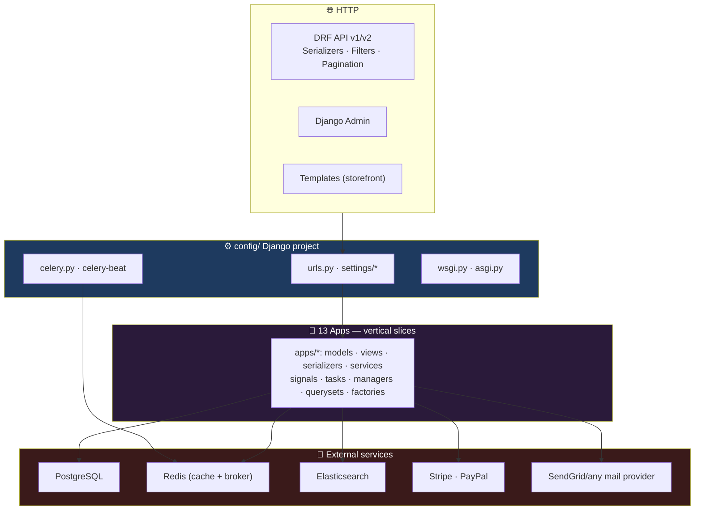
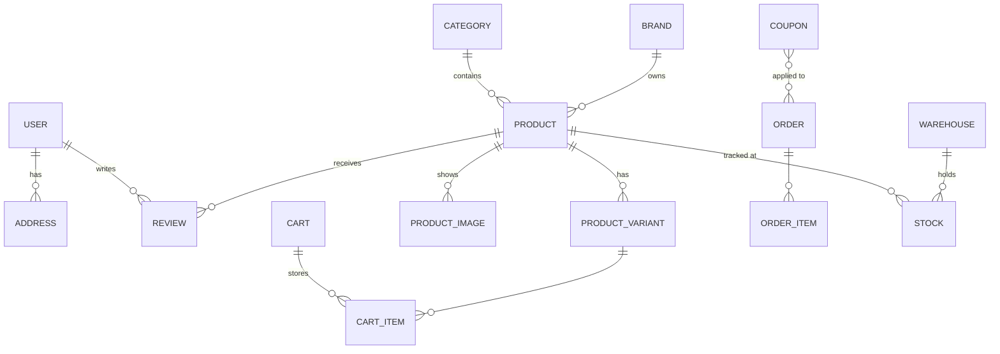
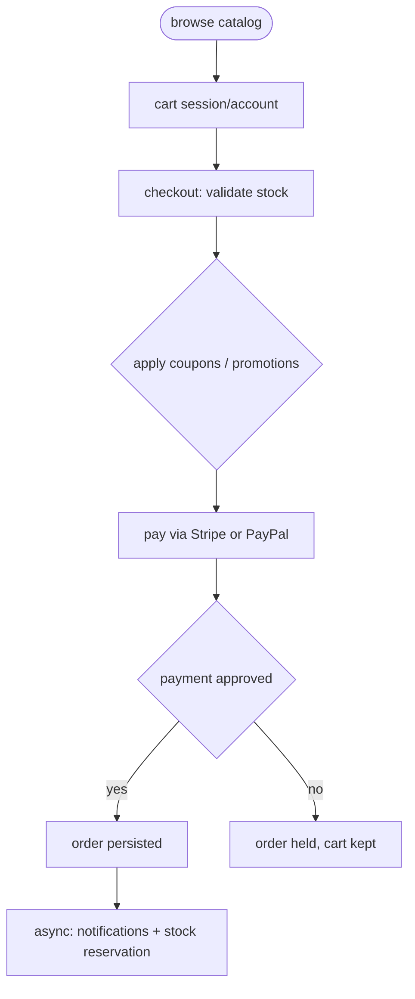
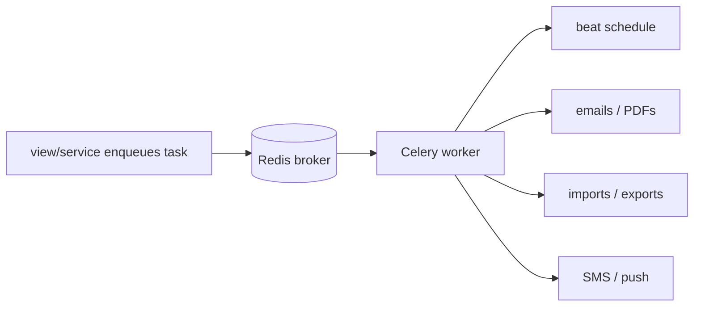

<div align="center">

**🌐 Choose Language / Selecione o Idioma / Elija el Idioma**

[](README.md)&nbsp;&nbsp;&nbsp;[](README_PT.md)&nbsp;&nbsp;&nbsp;[](README_ES.md)

</div>

---

<div align="center">

```
██████  █████  ████████    ██     ██    ██ ██████  ██████  ███████ ██████  ███████
█       █   █     ██        ██   ██    ██ ██  ██  ██      ██      ██   ██ ██
██████  █   █     ██    ██    ██ ██     ██ ██  ██  ██      █████   ██████  █████
█       █   █     ██    ██    ██  ██    ██ ██  ██  ██      ██      ██   ██ ██
██████  █████     ██      ██  ██   ██  ██  ██████  ██████  ███████ ██   ██ ███████
      E-commerce Python — Django, DRF, Celery and everything a large retail needs
```

---

[](https://www.python.org/)
[](https://www.djangoproject.com/)
[](https://www.django-rest-framework.org/)
[](https://www.postgresql.org/)
[](https://redis.io/)
[](https://docs.celeryq.dev/)
[](https://www.elastic.co/)
[]()

<br/>

> **A full-featured e-commerce platform built with Django and Django REST Framework** — catalog,
> cart, orders, payments (Stripe/PayPal), inventory, marketing, reviews, search, reports and a CMS,
> organized in **13 reusable apps** around one `config/` Django project.

<br/>


</div>

---

## 📑 Table of Contents

<details>
<summary>▶️ <strong>Click to expand / collapse this section</strong></summary>

<table>
<tr>
<td valign="top" width="50%">

**🏗️ System**
- [Overview](#-overview)
- [System Architecture](#-system-architecture)
- [Tech Stack](#-tech-stack)
- [Design Patterns](#-design-patterns-applied)
- [Project Structure](#-project-structure)

**📦 Modules**
- [The 13 Apps](#-the-13-apps)

**💼 Business**
- [Business Rules](#-business-rules)
- [Functional Requirements](#-functional-requirements)
- [Non-Functional Requirements](#-non-functional-requirements)

</td>
<td valign="top" width="50%">

**📐 Design**
- [Data Model](#-data-model)
- [System Flows](#-system-flows)

**🔐 Security & Operations**
- [Security](#-security)
- [Installation & Running](#-installation--running)
- [Automated Tests](#-automated-tests)
- [Metrics & Monitoring](#-metrics--monitoring)
- [Known Limitations](#-known-limitations)

</td>
</tr>
</table>

---

</details>

## 🌟 Overview

<details>
<summary>▶️ <strong>Click to expand / collapse this section</strong></summary>

**E-Commerce Python** is a full-featured e-commerce platform built with **Django 4.2+** and **Django REST Framework 3.14+** — product catalog with categories, brands, variants and images; user management with registration, profiles and addresses; shopping cart with coupons and wishlist; orders with checkout, tracking and returns; payments through **Stripe and PayPal**; inventory with warehouses and suppliers; marketing with coupons, promotions, banners and newsletters; email/SMS/push notifications; reviews & ratings; full-text search with autocomplete; sales reports and dashboards; and a **CMS** for pages, menus, FAQs and testimonials.

The whole solution is split into **13 Django apps** under one `config/` project — each app is a self-contained vertical (models, serializers, views, filters, services, tasks, signals). Redis backs cache and queue, **Celery** runs async jobs with beat schedules, and Elasticsearch is available (optional) for fast full-text search.

### 🎯 System Goals

| Goal | Description |
|------|-------------|
| 🛍️ **End-to-end commerce** | Catalog → cart → checkout → payment → fulfillment → returns |
| 🧩 **Reusable apps** | 13 vertical modules, each with models, API, services, tasks |
| 💳 **Real payments** | Stripe and PayPal behind service abstractions |
| ⚙️ **Async everything** | Celery + Redis for emails, PDFs, imports, notifications |
| 🔍 **Fast search** | Elasticsearch-backed full-text search with autocomplete (optional) |
| 🧪 **Tested vertically** | factory-boy + faker + pytest-django across all 13 apps |

---

</details>

## 🏗️ System Architecture

<details>
<summary>▶️ <strong>Click to expand / collapse this section</strong></summary>

### Django MVT with Vertical Slices



### App Layering

Each app is a **vertical slice** — no cross-app imports leak into models; sharing happens through `apps/common` (abstract models, mixins, utilities) and `apps/reports` aggregates read data from the other apps.

---

</details>

## 🛠️ Tech Stack

<details>
<summary>▶️ <strong>Click to expand / collapse this section</strong></summary>

| Layer | Technology | Purpose |
|-------|-----------|---------|
| 🧠 **Language** | Python 3.11+ | Everything |
| 🗄️ **Web framework** | Django 4.2+ | Models, ORM, admin, templates |
| 🔌 **API** | DRF 3.14+, `django-filter` | Versioned REST API |
| 🔐 **Auth** | SimpleJWT, django-oauth-toolkit, django-allauth | JWT + OAuth2 + social |
| 🗃️ **Database** | PostgreSQL (`psycopg2`, `dj-database-url`) | Primary store |
| ⚡ **Cache & broker** | Redis + django-redis + celery | Cache, queues, beat schedules |
| 🔍 **Search** | Elasticsearch (elasticsearch-dsl, django-elasticsearch-dsl) | Full-text + autocomplete (optional) |
| 💳 **Payments** | stripe, paypalrestsdk | Checkout providers |
| ✉️ **Email** | django-anymail, dj-email-url | Transactional & campaign mail |
| 📊 **Monitoring** | sentry-sdk, django-debug-toolbar, django-silk, django-redisboard | Errors, profiling, Redis dashboards |
| 🧪 **Testing** | pytest-django, factory-boy, faker, coverage, pytest-xdist | Fast parallel test runs |
| 📄 **Docs** | drf-yasg, drf-spectacular | Swagger UI + ReDoc |
| 📦 **Utilities** | django-parler, django-mptt, weasyprint, xhtml2pdf, qrcode, shortuuid, django-hashid-field, django-import-export | i18n, trees, PDFs, hashing, import/export |

---

</details>

## 📐 Design Patterns Applied

<details>
<summary>▶️ <strong>Click to expand / collapse this section</strong></summary>

| Pattern | Where | Why |
|---------|-------|-----|
| 🧱 **MVT (Model-View-Template)** | Django core | Batteries-included web framework |
| 🔌 **App as vertical slice** | `apps/*` | Model + serializer + service + task in one cohesive module |
| 🧬 **Model mixins** | `apps/common` | `UUIDModel`, `TimeStampedModel`, `SoftDeleteModel`, `ActivatableModel`, `TranslatableModel`, `SEOModel` reused everywhere |
| 🌳 **MPTT tree** | `django-mptt` categories, menus | Hierarchies queried in one pass |
| 🌐 **Translation** | `django-parler` (`TranslatableModel`) | Content translated across languages |
| 🎯 **Custom managers & querysets** | `managers.py` / `querysets.py` per app | Query logic lives next to the model |
| 📡 **Signals** | `signals.py` per app | Side effects (cleanup, sync) without coupling views |
| ⚙️ **Celery tasks** | `tasks.py` per app | Emails, PDFs, imports run out-of-band |
| 🧪 **Factories** | `factories.py` per app | Deterministic test data with factory-boy |

---

</details>

## 📁 Project Structure

<details>
<summary>▶️ <strong>Click to expand / collapse this section</strong></summary>

```
ecommerce-python/
│
├── 📂 apps/                        # 13 vertical modules
│   ├── 📂 cart/                    #    sessions, coupons use, wishlist
│   ├── 📂 cms/                     #    pages, menus, FAQs, testimonials
│   ├── 📂 common/                  #    shared mixins, models, utilities
│   ├── 📂 inventory/               #    stock, warehouses, suppliers
│   ├── 📂 marketing/               #    coupons, promotions, banners, newsletters
│   ├── 📂 notifications/           #    email, SMS, push dispatch
│   ├── 📂 orders/                  #    checkout, tracking, returns
│   ├── 📂 payments/                #    Stripe, PayPal gateways
│   ├── 📂 products/                #    categories, brands, variants, images
│   ├── 📂 reports/                 #    sales reports, dashboards
│   ├── 📂 reviews/                 #    reviews, votes, reports
│   ├── 📂 search/                  #    Elasticsearch index & queries
│   └── 📂 users/                   #    accounts, profiles, addresses
│
├── 📂 config/                      # Django project: settings/*, urls, celery, wsgi/asgi
├── 📂 scripts/                     # seed_data.py etc.
├── 📂 tests/                       # 87 test files (172 test functions)
├── 📂 fixtures/  📂 locale/  📂 docs/  📂 templates/  📂 static/
├── 📂 docker/                      # docker-compose stack
│
├── 📄 manage.py  📄 pyproject.toml  📄 requirements.txt  📄 Makefile
├── 📄 pytest.ini  📄 setup.cfg  📄 tox.ini  📄 .pre-commit-config.yaml
│
├── 📄 README.md                    # 🇺🇸 English (primary)
├── 📄 README_PT.md                 # 🇧🇷 Português
└── 📄 README_ES.md                 # 🇪🇸 Español
```

---

</details>

## 📦 The 13 Apps

<details>
<summary>▶️ <strong>Click to expand / collapse this section</strong></summary>

| App | Responsibility | Highlights |
|-----|----------------|------------|
| 👥 **users** | Accounts, profiles, addresses | JWT, OAuth2, allauth, social login |
| 🛍️ **products** | Categories, brands, products, variants, images | Translated + MPTT categories, SEO, soft-delete |
| 🛒 **cart** | Cart session, coupons, wishlist | Coupon application, per-account persistence |
| 📦 **orders** | Checkout, tracking, returns | State machine, lifecycle history |
| 💳 **payments** | Gateways | Stripe, PayPal behind a service interface |
| 🏬 **inventory** | Stock, warehouses, suppliers | Reservation & stock levels per warehouse |
| 🎯 **marketing** | Coupons, promotions, banners, newsletters | Campaign-scoped content |
| ✉️ **notifications** | Email, SMS, push | Async dispatch via Celery |
| ⭐ **reviews** | Reviews, votes, reports | Ratings with content moderation |
| 🔍 **search** | Full-text index & autocomplete | Elasticsearch DSL integration |
| 📊 **reports** | Sales reports, dashboards | Aggregate analytics across apps |
| 📝 **cms** | Pages, menus, FAQs, testimonials | Site content management |
| 🧰 **common** | Shared mixins & utilities | `UUIDModel`, soft-delete, translation base |

---

</details>

## 📋 Business Rules

<details>
<summary>▶️ <strong>Click to expand / collapse this section</strong></summary>

| # | Rule | Detail |
|---|-------|--------|
| **BR-01** | Quantity cannot exceed inventory | Checkout validated against warehouse stock levels |
| **BR-02** | Cart is session- or account-based | Anonymous carts keep state; logged-in carts persist to the account |
| **BR-03** | Payments only via Stripe or PayPal | One payment service interface, interchangeable gateways |
| **BR-04** | Coupons apply before payment | Discounts computed at checkout and persisted with the order |
| **BR-05** | Orders follow a lifecycle | Series of states with tracking and returns flow |
| **BR-06** | Reviews require a rating | A review without a rating is incomplete |
| **BR-07** | Campaigns scope marketing content | Coupons, banners and newsletters are campaign-scoped |
| **BR-08** | Notifications dispatch asynchronously | Any mail/SMS/push job runs on Celery, never blocking the request |

---

</details>

## ✨ Functional Requirements

<details>
<summary>▶️ <strong>Click to expand / collapse this section</strong></summary>

| ID | Feature | Priority | Status |
|----|---------|----------|--------|
| **FR-01** | Product catalog (categories, brands, variants, images) | 🔴 High | ✅ Implemented |
| **FR-02** | User management (registration, auth, profiles, addresses) | 🔴 High | ✅ Implemented |
| **FR-03** | Shopping cart + coupons + wishlist | 🔴 High | ✅ Implemented |
| **FR-04** | Checkout, order tracking, returns | 🔴 High | ✅ Implemented |
| **FR-05** | Payments via Stripe and PayPal | 🔴 High | ✅ Implemented |
| **FR-06** | Inventory (stock, warehouses, suppliers) | 🟡 Medium | ✅ Implemented |
| **FR-07** | Marketing (coupons, promotions, banners, newsletters) | 🟡 Medium | ✅ Implemented |
| **FR-08** | Notifications (email, SMS, push) | 🟡 Medium | ✅ Implemented |
| **FR-09** | Reviews & ratings (votes, reports) | 🟡 Medium | ✅ Implemented |
| **FR-10** | Full-text search + autocomplete | 🟡 Medium | ✅ Implemented (Elasticsearch) |
| **FR-11** | Sales reports & dashboards | 🟡 Medium | ✅ Implemented |
| **FR-12** | CMS (pages, menus, FAQs, testimonials) | 🟡 Medium | ✅ Implemented |
| **FR-13** | Versioned REST API with Swagger/ReDoc | 🔴 High | ✅ Implemented |

---

</details>

## ⚙️ Non-Functional Requirements

<details>
<summary>▶️ <strong>Click to expand / collapse this section</strong></summary>

| ID | Category | Requirement | Metric |
|----|----------|-------------|--------|
| **NFR-01** | 🧱 Maintainability | Apps are self-contained verticals | Reuse via `common`, one coherent `config/` |
| **NFR-02** | ⚡ Performance | Cache-aside with Redis | Hot reads cached, writes async |
| **NFR-03** | ⚙️ Scalability | Celery for async work | Broker-backed, beat scheduling |
| **NFR-04** | 🔌 Portability | Services behind interfaces | Payments/mail/search swappable |
| **NFR-05** | 📐 Consistency | Migrations manage schema | Django migrations (24 files) |
| **NFR-06** | 🧪 Quality gate | pytest + coverage across apps | 87 test files / 172 tests |
| **NFR-07** | ✅ Reproducibility | pre-commit + tox + Makefile | Lint & test in CI |
| **NFR-08** | 🌍 i18n | django-parler translations | `locale/` catalog present |

---

</details>

## 🗄️ Data Model

<details>
<summary>▶️ <strong>Click to expand / collapse this section</strong></summary>

### Core Aggregates



### Base Mixins (`apps/common`)

| Mixin | Behavior |
|-------|----------|
| `UUIDModel` | UUID primary keys instead of integers |
| `TimeStampedModel` | `created_at` / `updated_at` |
| `SoftDeleteModel` | Records archived instead of deleted |
| `ActivatableModel` | `is_active` toggle |
| `TranslatableModel` | `django-parler` translated fields |
| `SEOModel` | Title + meta description for search engines |

---

</details>

## 🔄 System Flows

<details>
<summary>▶️ <strong>Click to expand / collapse this section</strong></summary>

### Checkout Flow



### Celery Async Flow



---

</details>

## 🔐 Security

<details>
<summary>▶️ <strong>Click to expand / collapse this section</strong></summary>

### Controls Implemented

| Control | Implementation | Effect |
|---------|---------------|--------|
| 🔑 **Authentication** | SimpleJWT + django-allauth | JWT tokens, social login, sessions |
| 🛡️ **OAuth2 provider** | django-oauth-toolkit | Third-party apps trusted with scoped tokens |
| 🌐 **CORS** | django-cors-headers | API surface exposed safely for clients |
| 🧱 **Abstractions for secrets** | python-decouple / django-environ, `.env` | Keys out of the repository |
| 📉 **Throttling & filters** | DRF throttling + django-filter | Abuse control on public endpoints |
| 🧹 **Hashed IDs** | django-hashid-field + shortuuid | Opaque public identifiers |

### Known Security Notes

| Limitation | Risk | Mitigation Path |
|------------|------|-----------------|
| 🛰️ **Live payment keys** | Stripe/PayPal run in test/sandbox mode until production keys | Configure `.env` for live keys |
| 🔓 **Rate limiting depth** | Throttling defaults are per-endpoint, not per-user-policy | Tighten with production policy |

---

</details>

## 🚀 Installation & Running

<details>
<summary>▶️ <strong>Click to expand / collapse this section</strong></summary>

### Getting Started

```bash
# Clone repository
git clone https://github.com/yourrepo/ecommerce-python.git
cd ecommerce-python

# Create virtual environment
python -m venv venv
source venv/bin/activate  # Windows: venv\Scripts\activate

# Install dependencies
pip install -r requirements.txt

# Setup environment
cp .env.example .env
# Edit .env with your settings

# Run migrations
python manage.py migrate

# Create superuser
python manage.py createsuperuser

# Seed data (optional)
python scripts/seed_data.py

# Run server
python manage.py runserver
```

### API Documentation

- Swagger UI: `/swagger/`
- ReDoc: `/redoc/`

### Docker

```bash
cd docker
docker-compose up -d
```

### Testing

```bash
pytest -v --cov=apps        # sequential
pytest -n auto              # parallel via pytest-xdist
```

---

</details>

## 🧪 Automated Tests

<details>
<summary>▶️ <strong>Click to expand / collapse this section</strong></summary>

Tests live **inside each app** (`test_admin.py`, `test_models.py`, `test_serializers.py`, `test_views.py`, `test_tasks.py` …) plus the top-level `tests/` suite — with **factory-boy factories and faker** per app for deterministic data.

| Property | Value |
|----------|-------|
| Test files | 87 |
| Test functions | 172 |
| Data factories | factory-boy, one `factories.py` per app |
| Fake data | faker |
| Runner | pytest-django (+ xdist for parallelism) |
| Coverage | coverage + pytest-cov, target `apps/` |

```bash
pytest tests/ -v --cov=apps
```

---

</details>

## 📊 Metrics & Monitoring

<details>
<summary>▶️ <strong>Click to expand / collapse this section</strong></summary>

| Metric | Value |
|--------|-------|
| Django apps | 13 |
| Model classes | 92 (13 model files) |
| Python files | 426 |
| Migration files | 24 |
| Test files / functions | 87 / 172 |
| API style | DRF, versioned, Swagger + ReDoc |
| Cache & broker | Redis |
| Async | Celery + celery-beat |
| Search | Elasticsearch (optional) |
| Monitoring | Sentry, debug-toolbar, Silk, Redisboard |

### Quick Commands

```bash
python manage.py migrate
python manage.py createsuperuser
python scripts/seed_data.py
python manage.py runserver
pytest -n auto --cov=apps
cd docker && docker-compose up -d
```

---

</details>

## ⚠️ Known Limitations

<details>
<summary>▶️ <strong>Click to expand / collapse this section</strong></summary>

| Category | Issue | Status |
|----------|-------|--------|
| 🔍 **Search is optional** | Elasticsearch must run for full-text; without it, search degrades to DB fallback | ⚠️ Config-driven |
| 💳 **Live payment keys** | Stripe/PayPal run in test/sandbox until production keys are set | ⚠️ Config-driven |
| 📤 **Sending infrastructure** | Email/SMS/push need provider keys (anymail/SES/Twilio) | ⚠️ Config-driven |
| 🖥️ **Django dev server** | `runserver` is for development; production should use gunicorn/uvicorn + a reverse proxy | ⚠️ Operations |
| 🔄 **Broker dependency** | Celery assumes Redis is reachable; local development should start the compose stack | ⚠️ Dev workflow |

</details>

---

<div align="center">

---

### 🛒 E-Commerce Python

*13 apps, one retail platform.*

[]()
[]()
[]()

<br/>

```
"Model mixins, vertical apps, async tasks — commerce without the chaos."
```

</div>