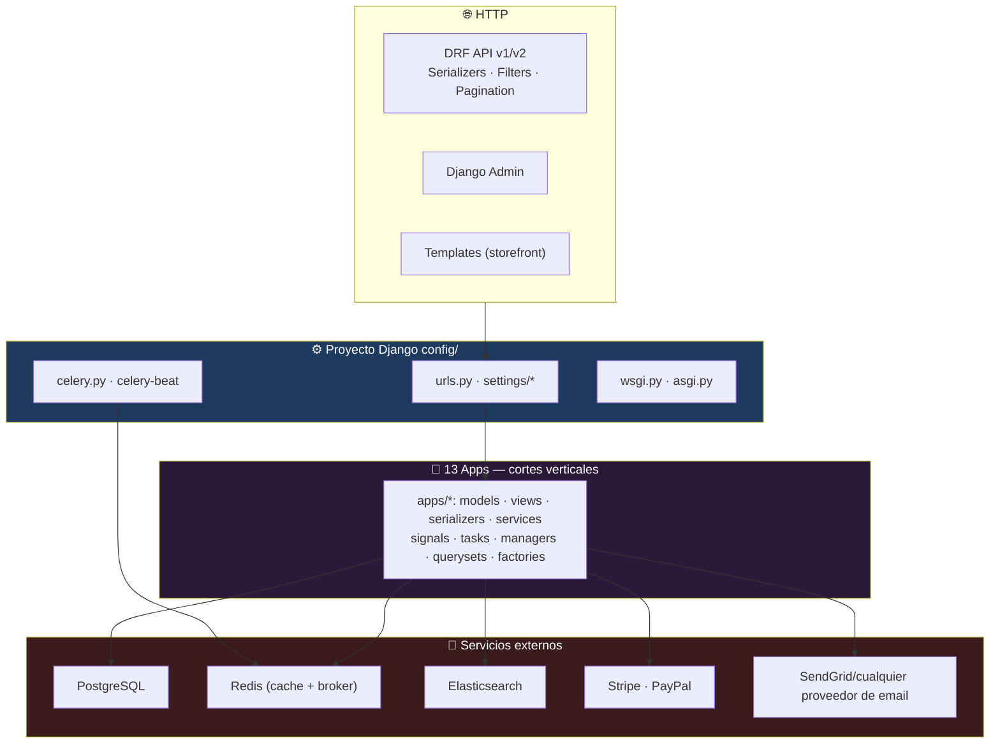
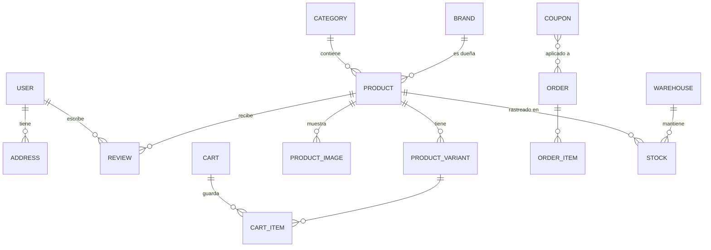
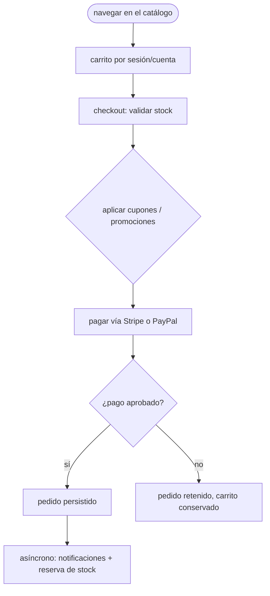
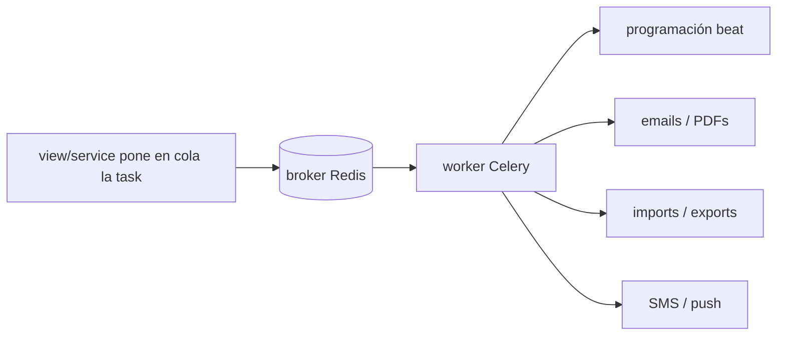

<div align="center">

**🌐 Choose Language / Selecione o Idioma / Elija el Idioma**

[](README.md)&nbsp;&nbsp;&nbsp;[](README_PT.md)&nbsp;&nbsp;&nbsp;[](README_ES.md)

</div>

---

<div align="center">

```
██████  █████  ████████    ██     ██    ██ ██████  ██████  ███████ ██████  ███████
█       █   █     ██        ██   ██    ██ ██  ██  ██      ██      ██   ██ ██
██████  █   █     ██    ██    ██ ██     ██ ██  ██  ██      █████   ██████  █████
█       █   █     ██    ██    ██  ██    ██ ██  ██  ██      ██      ██   ██ ██
██████  █████     ██      ██  ██   ██  ██  ██████  ██████  ███████ ██   ██ ███████
    E-commerce Python — Django, DRF, Celery y todo lo que un gran retail necesita
```

---

[](https://www.python.org/)
[](https://www.djangoproject.com/)
[](https://www.django-rest-framework.org/)
[](https://www.postgresql.org/)
[](https://redis.io/)
[](https://docs.celeryq.dev/)
[](https://www.elastic.co/)
[]()

<br/>

> **Una plataforma de e-commerce completa construida con Django y Django REST Framework** — catálogo,
> carrito, pedidos, pagos (Stripe/PayPal), inventario, marketing, reseñas, búsqueda, reportes y un CMS,
> organizados en **13 apps reutilizables** en torno a un único proyecto Django `config/`.

<br/>


</div>

---

## 📑 Índice

<details>
<summary>▶️ <strong>Haz clic para expandir / contraer esta sección</strong></summary>

<table>
<tr>
<td valign="top" width="50%">

**🏗️ Sistema**
- [Visión General](#-visión-general)
- [Arquitectura del Sistema](#-arquitectura-del-sistema)
- [Stack Tecnológica](#-stack-tecnológica)
- [Patrones de Diseño](#-patrones-de-diseño-aplicados)
- [Estructura del Proyecto](#-estructura-del-proyecto)

**📦 Módulos**
- [Las 13 Apps](#-las-13-apps)

**💼 Negocio**
- [Reglas de Negocio](#-reglas-de-negocio)
- [Requisitos Funcionales](#-requisitos-funcionales)
- [Requisitos No Funcionales](#-requisitos-no-funcionales)

</td>
<td valign="top" width="50%">

**📐 Diseño**
- [Modelo de Datos](#-modelo-de-datos)
- [Flujos del Sistema](#-flujos-del-sistema)

**🔐 Seguridad & Operación**
- [Seguridad](#-seguridad)
- [Instalación & Ejecución](#-instalación--ejecución)
- [Pruebas Automatizadas](#-pruebas-automatizadas)
- [Métricas & Monitoreo](#-métricas--monitoreo)
- [Limitaciones Conocidas](#-limitaciones-conocidas)

</td>
</tr>
</table>

---

</details>

## 🌟 Visión General

<details>
<summary>▶️ <strong>Haz clic para expandir / contraer esta sección</strong></summary>

**E-Commerce Python** es una plataforma de e-commerce completa construida con **Django 4.2+** y **Django REST Framework 3.14+** — catálogo de productos con categorías, marcas, variantes e imágenes; gestión de usuarios con registro, perfiles y direcciones; carrito de compras con cupones y lista de deseos; pedidos con checkout, seguimiento y devoluciones; pagos con **Stripe y PayPal**; inventario con almacenes y proveedores; marketing con cupones, promociones, banners y newsletters; notificaciones por email/SMS/push; reseñas y calificaciones; búsqueda de texto completo con autocompletado; informes de ventas y dashboards; y un **CMS** para páginas, menús, FAQs y testimonios.

Toda la solución se divide en **13 apps Django** bajo un proyecto `config/` — cada app es un corte vertical autocontenido (models, serializers, views, filters, services, tasks, signals). Redis da soporte a caché y cola, **Celery** ejecuta trabajos asíncronos con programación beat, y Elasticsearch está disponible (opcional) para búsqueda de texto completo de alto rendimiento.

### 🎯 Objetivos del Sistema

| Objetivo | Descripción |
|----------|-------------|
| 🛍️ **Comercio de punta a punta** | Catálogo → carrito → checkout → pago → fulfillment → devoluciones |
| 🧩 **Apps reutilizables** | 13 módulos verticales, cada uno con models, API, services y tasks |
| 💳 **Pagos reales** | Stripe y PayPal detrás de abstracciones de servicio |
| ⚙️ **Todo asíncrono** | Celery + Redis para emails, PDFs, imports, notificaciones |
| 🔍 **Búsqueda rápida** | Full-text con autocompletado respaldado por Elasticsearch (opcional) |
| 🧪 **Probado verticalmente** | factory-boy + faker + pytest-django en las 13 apps |

---

</details>

## 🏗️ Arquitectura del Sistema

<details>
<summary>▶️ <strong>Haz clic para expandir / contraer esta sección</strong></summary>

### Django MVT con Cortes Verticales



### Capas de las Apps

Cada app es un **corte vertical** — los imports entre apps no se filtran a los models; el compartir ocurre vía `apps/common` (modelos abstractos, mixins, utilidades) y `apps/reports` agrega lectura de datos de las demás apps.

---

</details>

## 🛠️ Stack Tecnológica

<details>
<summary>▶️ <strong>Haz clic para expandir / contraer esta sección</strong></summary>

| Capa | Tecnología | Propósito |
|------|-----------|-----------|
| 🧠 **Lenguaje** | Python 3.11+ | Todo |
| 🗄️ **Framework web** | Django 4.2+ | Models, ORM, admin, templates |
| 🔌 **API** | DRF 3.14+, `django-filter` | API REST versionada |
| 🔐 **Auth** | SimpleJWT, django-oauth-toolkit, django-allauth | JWT + OAuth2 + social |
| 🗃️ **Base de datos** | PostgreSQL (`psycopg2`, `dj-database-url`) | Almacenamiento principal |
| ⚡ **Caché y cola** | Redis + django-redis + celery | Caché, colas, programación beat |
| 🔍 **Búsqueda** | Elasticsearch (elasticsearch-dsl, django-elasticsearch-dsl) | Texto completo + autocompletado (opcional) |
| 💳 **Pagos** | stripe, paypalrestsdk | Proveedores de checkout |
| ✉️ **Email** | django-anymail, dj-email-url | Correos transaccionales y de campaña |
| 📊 **Monitoreo** | sentry-sdk, django-debug-toolbar, django-silk, django-redisboard | Errores, profiling, dashboards Redis |
| 🧪 **Pruebas** | pytest-django, factory-boy, faker, coverage, pytest-xdist | Ejecuciones de prueba rápidas y paralelas |
| 📄 **Docs** | drf-yasg, drf-spectacular | Swagger UI + ReDoc |
| 📦 **Utilidades** | django-parler, django-mptt, weasyprint, xhtml2pdf, qrcode, shortuuid, django-hashid-field, django-import-export | i18n, árboles, PDFs, hashing, import/export |

---

</details>

## 📐 Patrones de Diseño Aplicados

<details>
<summary>▶️ <strong>Haz clic para expandir / contraer esta sección</strong></summary>

| Patrón | Dónde | Justificación |
|--------|-------|---------------|
| 🧱 **MVT (Model-View-Template)** | Núcleo de Django | Framework web con baterías incluidas |
| 🔌 **App como corte vertical** | `apps/*` | Model + serializer + service + task en un módulo cohesivo |
| 🧬 **Model mixins** | `apps/common` | `UUIDModel`, `TimeStampedModel`, `SoftDeleteModel`, `ActivatableModel`, `TranslatableModel`, `SEOModel` reutilizados en todas partes |
| 🌳 **Árboles MPTT** | `django-mptt` en categorías, menús | Jerarquías consultadas en una pasada |
| 🌐 **Traducción** | `django-parler` (`TranslatableModel`) | Contenido traducido entre idiomas |
| 🎯 **Managers y querysets a medida** | `managers.py` / `querysets.py` por app | La lógica de query vive junto al model |
| 📡 **Signals** | `signals.py` por app | Efectos secundarios (limpieza, sync) sin acoplar views |
| ⚙️ **Celery tasks** | `tasks.py` por app | Emails, PDFs, imports fuera del request |
| 🧪 **Factories** | `factories.py` por app | Datos deterministas con factory-boy |

---

</details>

## 📁 Estructura del Proyecto

<details>
<summary>▶️ <strong>Haz clic para expandir / contraer esta sección</strong></summary>

```
ecommerce-python/
│
├── 📂 apps/                        # 13 módulos verticales
│   ├── 📂 cart/                    #    sesiones, uso de cupones, wishlist
│   ├── 📂 cms/                     #    páginas, menús, FAQs, testimonios
│   ├── 📂 common/                  #    mixins, models y utilidades compartidas
│   ├── 📂 inventory/               #    stock, almacenes, proveedores
│   ├── 📂 marketing/               #    cupones, promociones, banners, newsletters
│   ├── 📂 notifications/           #    despacho de email, SMS, push
│   ├── 📂 orders/                  #    checkout, seguimiento, devoluciones
│   ├── 📂 payments/                #    gateways Stripe, PayPal
│   ├── 📂 products/                #    categorías, marcas, variantes, imágenes
│   ├── 📂 reports/                 #    informes de ventas, dashboards
│   ├── 📂 reviews/                 #    reseñas, votos, reportes
│   ├── 📂 search/                  #    índice y queries de Elasticsearch
│   └── 📂 users/                   #    cuentas, perfiles, direcciones
│
├── 📂 config/                      # proyecto Django: settings/*, urls, celery, wsgi/asgi
├── 📂 scripts/                     # seed_data.py etc.
├── 📂 tests/                       # 87 archivos de prueba (172 funciones de prueba)
├── 📂 fixtures/  📂 locale/  📂 docs/  📂 templates/  📂 static/
├── 📂 docker/                      # stack docker-compose
│
├── 📄 manage.py  📄 pyproject.toml  📄 requirements.txt  📄 Makefile
├── 📄 pytest.ini  📄 setup.cfg  📄 tox.ini  📄 .pre-commit-config.yaml
│
├── 📄 README.md                    # 🇺🇸 Inglés (principal)
├── 📄 README_PT.md                 # 🇧🇷 Portugués
└── 📄 README_ES.md                 # 🇪🇸 Español
```

---

</details>

## 📦 Las 13 Apps

<details>
<summary>▶️ <strong>Haz clic para expandir / contraer esta sección</strong></summary>

| App | Responsabilidad | Destacados |
|-----|-----------------|------------|
| 👥 **users** | Cuentas, perfiles, direcciones | JWT, OAuth2, allauth, login social |
| 🛍️ **products** | Categorías, marcas, productos, variantes, imágenes | Categorías traducidas + MPTT, SEO, soft-delete |
| 🛒 **cart** | Carrito por sesión, cupones, wishlist | Aplicación de cupones, persistencia por cuenta |
| 📦 **orders** | Checkout, seguimiento, devoluciones | Máquina de estados, historial del ciclo de vida |
| 💳 **payments** | Gateways | Stripe, PayPal detrás de una interfaz de servicio |
| 🏬 **inventory** | Stock, almacenes, proveedores | Reserva y niveles de stock por almacén |
| 🎯 **marketing** | Cupones, promociones, banners, newsletters | Contenido con alcance por campaña |
| ✉️ **notifications** | Email, SMS, push | Despacho asíncrono vía Celery |
| ⭐ **reviews** | Reseñas, votos, reportes | Calificaciones con moderación de contenido |
| 🔍 **search** | Índice full-text y autocompletado | Integración con Elasticsearch DSL |
| 📊 **reports** | Informes de ventas, dashboards | Análisis agregados entre apps |
| 📝 **cms** | Páginas, menús, FAQs, testimonios | Gestión de contenido del sitio |
| 🧰 **common** | Mixins y utilidades compartidas | `UUIDModel`, soft-delete, base de traducción |

---

</details>

## 📋 Reglas de Negocio

<details>
<summary>▶️ <strong>Haz clic para expandir / contraer esta sección</strong></summary>

| # | Regla | Detalle |
|---|-------|---------|
| **BR-01** | La cantidad no puede exceder el inventario | Checkout validado contra los niveles de stock del almacén |
| **BR-02** | El carrito es por sesión o por cuenta | Carrito anónimo mantiene estado; con cuenta, persiste en la cuenta |
| **BR-03** | Pagos solo vía Stripe o PayPal | Una interfaz de servicio de pago, gateways intercambiables |
| **BR-04** | Los cupones aplican antes del pago | Descuentos calculados en el checkout y persistidos con el pedido |
| **BR-05** | Los pedidos siguen un ciclo de vida | Estados en serie con seguimiento y flujo de devolución |
| **BR-06** | Las reseñas exigen calificación | Una reseña sin calificación está incompleta |
| **BR-07** | Las campañas dan alcance al contenido de marketing | Cupones, banners y newsletters con alcance por campaña |
| **BR-08** | Las notificaciones despachan de forma asíncrona | Cualquier job de email/SMS/push corre en Celery, nunca bloqueando el request |

---

</details>

## ✨ Requisitos Funcionales

<details>
<summary>▶️ <strong>Haz clic para expandir / contraer esta sección</strong></summary>

| ID | Característica | Prioridad | Estado |
|----|----------------|-----------|--------|
| **RF-01** | Catálogo de productos (categorías, marcas, variantes, imágenes) | 🔴 Alta | ✅ Implementado |
| **RF-02** | Gestión de usuarios (registro, auth, perfiles, direcciones) | 🔴 Alta | ✅ Implementado |
| **RF-03** | Carrito + cupones + wishlist | 🔴 Alta | ✅ Implementado |
| **RF-04** | Checkout, seguimiento de pedidos, devoluciones | 🔴 Alta | ✅ Implementado |
| **RF-05** | Pagos con Stripe y PayPal | 🔴 Alta | ✅ Implementado |
| **RF-06** | Inventario (stock, almacenes, proveedores) | 🟡 Media | ✅ Implementado |
| **RF-07** | Marketing (cupones, promociones, banners, newsletters) | 🟡 Media | ✅ Implementado |
| **RF-08** | Notificaciones (email, SMS, push) | 🟡 Media | ✅ Implementado |
| **RF-09** | Reseñas y calificaciones (votos, reportes) | 🟡 Media | ✅ Implementado |
| **RF-10** | Búsqueda full-text + autocompletado | 🟡 Media | ✅ Implementado (Elasticsearch) |
| **RF-11** | Informes de ventas y dashboards | 🟡 Media | ✅ Implementado |
| **RF-12** | CMS (páginas, menús, FAQs, testimonios) | 🟡 Media | ✅ Implementado |
| **RF-13** | API REST versionada con Swagger/ReDoc | 🔴 Alta | ✅ Implementado |

---

</details>

## ⚙️ Requisitos No Funcionales

<details>
<summary>▶️ <strong>Haz clic para expandir / contraer esta sección</strong></summary>

| ID | Categoría | Requisito | Métrica |
|----|-----------|-----------|---------|
| **RNF-01** | 🧱 Mantenibilidad | Las apps son cortes verticales autocontenidos | Reuso vía `common`, un `config/` coherente |
| **RNF-02** | ⚡ Rendimiento | Cache-aside con Redis | Lecturas calientes cacheadas, escrituras asíncronas |
| **RNF-03** | ⚙️ Escalabilidad | Celery para trabajo asíncrono | Respaldado por broker, programación beat |
| **RNF-04** | 🔌 Portabilidad | Servicios detrás de interfaces | Pagos/búsqueda/email intercambiables |
| **RNF-05** | 📐 Consistencia | Las migraciones gestionan el schema | Migraciones de Django (24 archivos) |
| **RNF-06** | 🧪 Portón de calidad | pytest + coverage en las apps | 87 archivos de prueba / 172 pruebas |
| **RNF-07** | ✅ Reproducibilidad | pre-commit + tox + Makefile | Lint y prueba en CI |
| **RNF-08** | 🌍 i18n | Traducciones con django-parler | Catálogo `locale/` presente |

---

</details>

## 🗄️ Modelo de Datos

<details>
<summary>▶️ <strong>Haz clic para expandir / contraer esta sección</strong></summary>

### Agregados Principales



### Mixins Base (`apps/common`)

| Mixin | Comportamiento |
|-------|----------------|
| `UUIDModel` | Primary keys UUID en lugar de enteros |
| `TimeStampedModel` | `created_at` / `updated_at` |
| `SoftDeleteModel` | Registros archivados en lugar de eliminados |
| `ActivatableModel` | Toggle `is_active` |
| `TranslatableModel` | Campos traducibles de `django-parler` |
| `SEOModel` | Título + meta description para buscadores |

---

</details>

## 🔄 Flujos del Sistema

<details>
<summary>▶️ <strong>Haz clic para expandir / contraer esta sección</strong></summary>

### Flujo de Checkout



### Flujo Asíncrono Celery



---

</details>

## 🔐 Seguridad

<details>
<summary>▶️ <strong>Haz clic para expandir / contraer esta sección</strong></summary>

### Controles Implementados

| Control | Implementación | Efecto |
|---------|----------------|--------|
| 🔑 **Autenticación** | SimpleJWT + django-allauth | Tokens JWT, login social, sesiones |
| 🛡️ **Proveedor OAuth2** | django-oauth-toolkit | Apps de terceros con tokens con alcance |
| 🌐 **CORS** | django-cors-headers | Superficie de la API expuesta de forma segura para clientes |
| 🧱 **Abstracciones para secretos** | python-decouple / django-environ, `.env` | Claves fuera del repositorio |
| 📉 **Throttling y filters** | Throttling de DRF + django-filter | Control de abuso en endpoints públicos |
| 🧹 **IDs con hash** | django-hashid-field + shortuuid | Identificadores públicos opacos |

### Notas de Seguridad Conocidas

| Limitación | Riesgo | Camino de Mitigación |
|------------|--------|----------------------|
| 🛰️ **Claves de pago en vivo** | Stripe/PayPal en modo test/sandbox hasta claves de producción | Configura el `.env` con claves en vivo |
| 🔓 **Profundidad del rate limit** | Throttling por defecto es por endpoint, no por política de usuario | Apretar con política de producción |

---

</details>

## 🚀 Instalación & Ejecución

<details>
<summary>▶️ <strong>Haz clic para expandir / contraer esta sección</strong></summary>

### Cómo Empezar

```bash
# Clonar repositorio
git clone https://github.com/yourrepo/ecommerce-python.git
cd ecommerce-python

# Crear entorno virtual
python -m venv venv
source venv/bin/activate  # Windows: venv\Scripts\activate

# Instalar dependencias
pip install -r requirements.txt

# Configurar el entorno
cp .env.example .env
# Edita el .env con tus ajustes

# Ejecutar migraciones
python manage.py migrate

# Crear superusuario
python manage.py createsuperuser

# Datos de seed (opcional)
python scripts/seed_data.py

# Levantar el servidor
python manage.py runserver
```

### Documentación de la API

- Swagger UI: `/swagger/`
- ReDoc: `/redoc/`

### Docker

```bash
cd docker
docker-compose up -d
```

### Pruebas

```bash
pytest -v --cov=apps        # secuencial
pytest -n auto              # en paralelo vía pytest-xdist
```

---

</details>

## 🧪 Pruebas Automatizadas

<details>
<summary>▶️ <strong>Haz clic para expandir / contraer esta sección</strong></summary>

Las pruebas viven **dentro de cada app** (`test_admin.py`, `test_models.py`, `test_serializers.py`, `test_views.py`, `test_tasks.py` …) más la suite de nivel superior en `tests/` — con **factories de factory-boy y faker** por app para datos deterministas.

| Propiedad | Valor |
|-----------|-------|
| Archivos de prueba | 87 |
| Funciones de prueba | 172 |
| Factories de datos | factory-boy, un `factories.py` por app |
| Datos falsos | faker |
| Runner | pytest-django (+ xdist para paralelismo) |
| Cobertura | coverage + pytest-cov, objetivo `apps/` |

```bash
pytest tests/ -v --cov=apps
```

---

</details>

## 📊 Métricas & Monitoreo

<details>
<summary>▶️ <strong>Haz clic para expandir / contraer esta sección</strong></summary>

| Métrica | Valor |
|---------|-------|
| Apps Django | 13 |
| Clases de model | 92 (13 archivos de model) |
| Archivos Python | 426 |
| Archivos de migración | 24 |
| Archivos / funciones de prueba | 87 / 172 |
| Estilo de la API | DRF, versionada, Swagger + ReDoc |
| Caché & broker | Redis |
| Asíncrono | Celery + celery-beat |
| Búsqueda | Elasticsearch (opcional) |
| Monitoreo | Sentry, debug-toolbar, Silk, Redisboard |

### Comandos Rápidos

```bash
python manage.py migrate
python manage.py createsuperuser
python scripts/seed_data.py
python manage.py runserver
pytest -n auto --cov=apps
cd docker && docker-compose up -d
```

---

</details>

## ⚠️ Limitaciones Conocidas

<details>
<summary>▶️ <strong>Haz clic para expandir / contraer esta sección</strong></summary>

| Categoría | Problema | Estado |
|-----------|----------|--------|
| 🔍 **La búsqueda es opcional** | Elasticsearch debe correr para el full-text; sin él, la búsqueda cae a fallback en el DB | ⚠️ Dirigido por config |
| 💳 **Claves de pago en vivo** | Stripe/PayPal corren en modo test/sandbox hasta configurar claves de producción | ⚠️ Dirigido por config |
| 📤 **Infraestructura de envío** | Email/SMS/push necesitan claves de proveedor (anymail/SES/Twilio) | ⚠️ Dirigido por config |
| 🖥️ **Servidor dev de Django** | `runserver` es para desarrollo; producción debe usar gunicorn/uvicorn + reverse proxy | ⚠️ Operaciones |
| 🔄 **Dependencia del broker** | Celery asume Redis accesible; el desarrollo local debe levantar el stack de compose | ⚠️ Flujo de dev |

</details>

---

<div align="center">

---

### 🛒 E-Commerce Python

*13 apps, una plataforma de retail.*

[]()
[]()
[]()

<br/>

```
"Model mixins, apps verticales, tasks asíncronas: comercio sin caos."
```

</div>