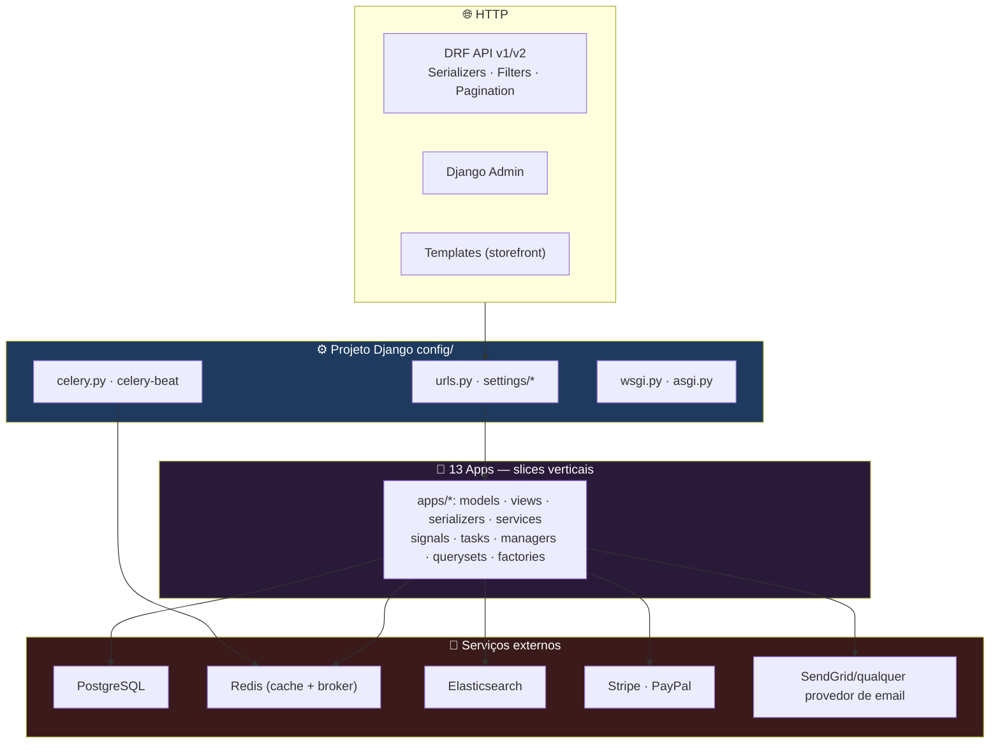
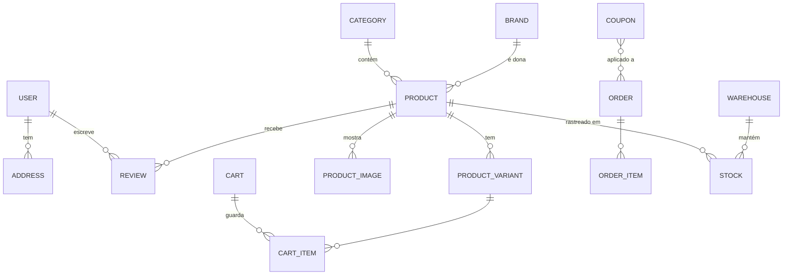
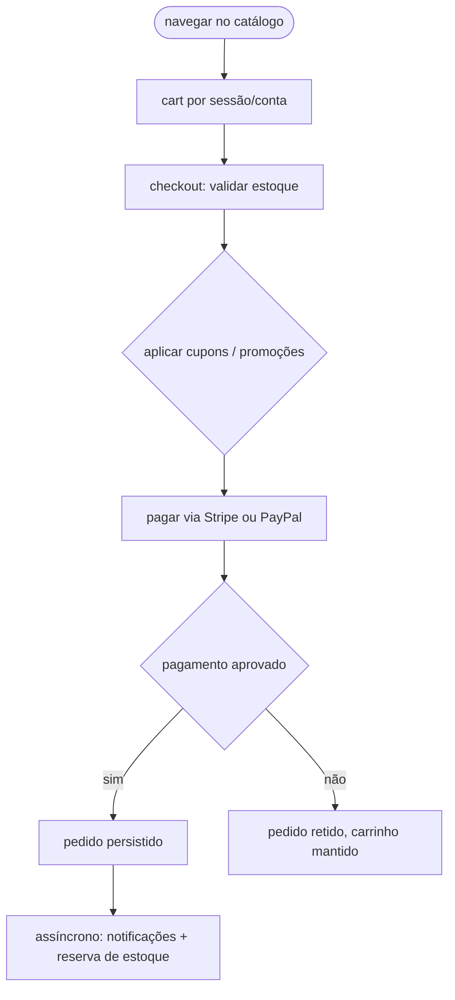
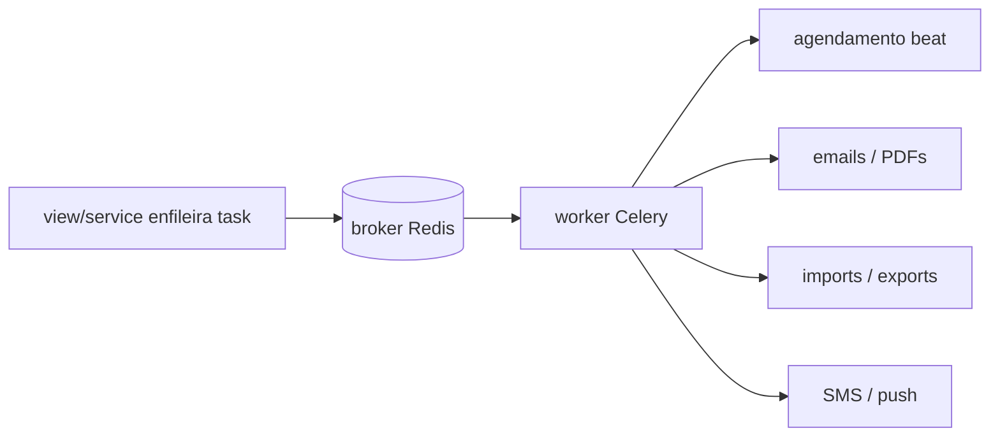

<div align="center">

**🌐 Choose Language / Selecione o Idioma / Elija el Idioma**

[](README.md)&nbsp;&nbsp;&nbsp;[](README_PT.md)&nbsp;&nbsp;&nbsp;[](README_ES.md)

</div>

---

<div align="center">

```
██████  █████  ████████    ██     ██    ██ ██████  ██████  ███████ ██████  ███████
█       █   █     ██        ██   ██    ██ ██  ██  ██      ██      ██   ██ ██
██████  █   █     ██    ██    ██ ██     ██ ██  ██  ██      █████   ██████  █████
█       █   █     ██    ██    ██  ██    ██ ██  ██  ██      ██      ██   ██ ██
██████  █████     ██      ██  ██   ██  ██  ██████  ██████  ███████ ██   ██ ███████
   E-commerce Python — Django, DRF, Celery e tudo o que um grande varejo precisa
```

---

[](https://www.python.org/)
[](https://www.djangoproject.com/)
[](https://www.django-rest-framework.org/)
[](https://www.postgresql.org/)
[](https://redis.io/)
[](https://docs.celeryq.dev/)
[](https://www.elastic.co/)
[]()

<br/>

> **Uma plataforma de e-commerce completa construída com Django e Django REST Framework** — catálogo,
> carrinho, pedidos, pagamentos (Stripe/PayPal), estoque, marketing, avaliações, busca, relatórios e um CMS,
> organizados em **13 apps reutilizáveis** em torno de um único projeto Django `config/`.

<br/>


</div>

---

## 📑 Índice

<details>
<summary>▶️ <strong>Clique para expandir / recolher esta seção</strong></summary>

<table>
<tr>
<td valign="top" width="50%">

**🏗️ Sistema**
- [Visão Geral](#-visão-geral)
- [Arquitetura do Sistema](#-arquitetura-do-sistema)
- [Stack Tecnológica](#-stack-tecnológica)
- [Padrões de Projeto](#-padrões-de-projeto-aplicados)
- [Estrutura do Projeto](#-estrutura-do-projeto)

**📦 Módulos**
- [Os 13 Apps](#-os-13-apps)

**💼 Negócio**
- [Regras de Negócio](#-regras-de-negócio)
- [Requisitos Funcionais](#-requisitos-funcionais)
- [Requisitos Não Funcionais](#-requisitos-não-funcionais)

</td>
<td valign="top" width="50%">

**📐 Design**
- [Modelo de Dados](#-modelo-de-dados)
- [Fluxos do Sistema](#-fluxos-do-sistema)

**🔐 Segurança & Operação**
- [Segurança](#-segurança)
- [Instalação & Execução](#-instalação--execução)
- [Testes Automatizados](#-testes-automatizados)
- [Métricas & Monitoramento](#-métricas--monitoramento)
- [Limitações Conhecidas](#-limitações-conhecidas)

</td>
</tr>
</table>

---

</details>

## 🌟 Visão Geral

<details>
<summary>▶️ <strong>Clique para expandir / recolher esta seção</strong></summary>

**E-Commerce Python** é uma plataforma de e-commerce completa construída com **Django 4.2+** e **Django REST Framework 3.14+** — catálogo de produtos com categorias, marcas, variantes e imagens; gerenciamento de usuários com registro, perfis e endereços; carrinho de compras com cupons e lista de desejos; pedidos com checkout, rastreio e devoluções; pagamentos via **Stripe e PayPal**; estoque com depósitos e fornecedores; marketing com cupons, promoções, banners e newsletters; notificações por email/SMS/push; avaliações e notas; busca em texto completo com autocomplete; relatórios de vendas e dashboards; e um **CMS** para páginas, menus, FAQs e depoimentos.

A solução toda é dividida em **13 apps Django** sob um projeto `config/` — cada app é um vertical autossuficiente (models, serializers, views, filters, services, tasks, signals). O Redis faz cache e fila, **Celery** roda jobs assíncronos com agendamento via beat, e o Elasticsearch está disponível (opcional) para busca em texto completo de alta performance.

### 🎯 Objetivos do Sistema

| Objetivo | Descrição |
|----------|-----------|
| 🛍️ **Comércio ponta a ponta** | Catálogo → carrinho → checkout → pagamento → fulfillment → devoluções |
| 🧩 **Apps reutilizáveis** | 13 módulos verticais, cada um com models, API, services e tasks |
| 💳 **Pagamentos reais** | Stripe e PayPal atrás de abstrações de serviço |
| ⚙️ **Tudo assíncrono** | Celery + Redis para emails, PDFs, imports, notificações |
| 🔍 **Busca rápida** | Full-text com autocomplete suportado por Elasticsearch (opcional) |
| 🧪 **Testado verticalmente** | factory-boy + faker + pytest-django nos 13 apps |

---

</details>

## 🏗️ Arquitetura do Sistema

<details>
<summary>▶️ <strong>Clique para expandir / recolher esta seção</strong></summary>

### Django MVT com Slices Verticais



### Camadas dos Apps

Cada app é um **slice vertical** — imports entre apps não vazam para os models; o compartilhamento acontece via `apps/common` (models abstratos, mixins, utilidades) e `apps/reports` agrega leitura de dados dos outros apps.

---

</details>

## 🛠️ Stack Tecnológica

<details>
<summary>▶️ <strong>Clique para expandir / recolher esta seção</strong></summary>

| Camada | Tecnologia | Propósito |
|--------|-----------|-----------|
| 🧠 **Linguagem** | Python 3.11+ | Tudo |
| 🗄️ **Framework web** | Django 4.2+ | Models, ORM, admin, templates |
| 🔌 **API** | DRF 3.14+, `django-filter` | API REST versionada |
| 🔐 **Auth** | SimpleJWT, django-oauth-toolkit, django-allauth | JWT + OAuth2 + social |
| 🗃️ **Banco** | PostgreSQL (`psycopg2`, `dj-database-url`) | Armazenamento principal |
| ⚡ **Cache & fila** | Redis + django-redis + celery | Cache, filas, agendamento beat |
| 🔍 **Busca** | Elasticsearch (elasticsearch-dsl, django-elasticsearch-dsl) | Full-text + autocomplete (opcional) |
| 💳 **Pagamentos** | stripe, paypalrestsdk | Provedores de checkout |
| ✉️ **Email** | django-anymail, dj-email-url | Emails transacionais e de campanha |
| 📊 **Monitoramento** | sentry-sdk, django-debug-toolbar, django-silk, django-redisboard | Erros, profiling, dashboards Redis |
| 🧪 **Testes** | pytest-django, factory-boy, faker, coverage, pytest-xdist | Rodadas de teste rápidas e paralelas |
| 📄 **Docs** | drf-yasg, drf-spectacular | Swagger UI + ReDoc |
| 📦 **Utilidades** | django-parler, django-mptt, weasyprint, xhtml2pdf, qrcode, shortuuid, django-hashid-field, django-import-export | i18n, árvores, PDFs, hashing, import/export |

---

</details>

## 📐 Padrões de Projeto Aplicados

<details>
<summary>▶️ <strong>Clique para expandir / recolher esta seção</strong></summary>

| Padrão | Onde | Justificativa |
|--------|------|---------------|
| 🧱 **MVT (Model-View-Template)** | Núcleo do Django | Framework web com baterias incluídas |
| 🔌 **App como slice vertical** | `apps/*` | Model + serializer + service + task num módulo coeso |
| 🧬 **Model mixins** | `apps/common` | `UUIDModel`, `TimeStampedModel`, `SoftDeleteModel`, `ActivatableModel`, `TranslatableModel`, `SEOModel` reutilizados em todo lugar |
| 🌳 **Árvores MPTT** | `django-mptt` nas categorias, menus | Hierarquias consultadas em uma passada |
| 🌐 **Tradução** | `django-parler` (`TranslatableModel`) | Conteúdo traduzido entre idiomas |
| 🎯 **Managers & querysets customizados** | `managers.py` / `querysets.py` por app | Lógica de query junto ao model |
| 📡 **Signals** | `signals.py` por app | Efeitos colaterais (limpeza, sync) sem acoplar views |
| ⚙️ **Tasks Celery** | `tasks.py` por app | Emails, PDFs, imports fora do request |
| 🧪 **Factories** | `factories.py` por app | Dados determinísticos com factory-boy |

---

</details>

## 📁 Estrutura do Projeto

<details>
<summary>▶️ <strong>Clique para expandir / recolher esta seção</strong></summary>

```
ecommerce-python/
│
├── 📂 apps/                        # 13 módulos verticais
│   ├── 📂 cart/                    #    sessões, uso de cupons, wishlist
│   ├── 📂 cms/                     #    páginas, menus, FAQs, depoimentos
│   ├── 📂 common/                  #    mixins, models e utilidades compartilhados
│   ├── 📂 inventory/               #    estoque, depósitos, fornecedores
│   ├── 📂 marketing/               #    cupons, promoções, banners, newsletters
│   ├── 📂 notifications/           #    despacho de email, SMS, push
│   ├── 📂 orders/                  #    checkout, rastreio, devoluções
│   ├── 📂 payments/                #    gateways Stripe, PayPal
│   ├── 📂 products/                #    categorias, marcas, variantes, imagens
│   ├── 📂 reports/                 #    relatórios de vendas, dashboards
│   ├── 📂 reviews/                 #    avaliações, votos, denúncias
│   ├── 📂 search/                  #    índice e queries do Elasticsearch
│   └── 📂 users/                   #    contas, perfis, endereços
│
├── 📂 config/                      # projeto Django: settings/*, urls, celery, wsgi/asgi
├── 📂 scripts/                     # seed_data.py etc.
├── 📂 tests/                       # 87 arquivos de teste (172 funções de teste)
├── 📂 fixtures/  📂 locale/  📂 docs/  📂 templates/  📂 static/
├── 📂 docker/                      # stack docker-compose
│
├── 📄 manage.py  📄 pyproject.toml  📄 requirements.txt  📄 Makefile
├── 📄 pytest.ini  📄 setup.cfg  📄 tox.ini  📄 .pre-commit-config.yaml
│
├── 📄 README.md                    # 🇺🇸 Inglês (principal)
├── 📄 README_PT.md                 # 🇧🇷 Português
└── 📄 README_ES.md                 # 🇪🇸 Espanhol
```

---

</details>

## 📦 Os 13 Apps

<details>
<summary>▶️ <strong>Clique para expandir / recolher esta seção</strong></summary>

| App | Responsabilidade | Destaques |
|-----|------------------|-----------|
| 👥 **users** | Contas, perfis, endereços | JWT, OAuth2, allauth, login social |
| 🛍️ **products** | Categorias, marcas, produtos, variantes, imagens | Categorias traduzidas + MPTT, SEO, soft-delete |
| 🛒 **cart** | Carrinho por sessão, cupons, wishlist | Aplicação de cupons, persistência por conta |
| 📦 **orders** | Checkout, rastreio, devoluções | Máquina de estados, histórico do ciclo de vida |
| 💳 **payments** | Gateways | Stripe, PayPal atrás de uma interface de serviço |
| 🏬 **inventory** | Estoque, depósitos, fornecedores | Reserva e níveis de estoque por depósito |
| 🎯 **marketing** | Cupons, promoções, banners, newsletters | Conteúdo escopado por campanha |
| ✉️ **notifications** | Email, SMS, push | Despacho assíncrono via Celery |
| ⭐ **reviews** | Avaliações, votos, denúncias | Notas com moderação de conteúdo |
| 🔍 **search** | Índice full-text e autocomplete | Integração com Elasticsearch DSL |
| 📊 **reports** | Relatórios de vendas, dashboards | Análises agregadas entre apps |
| 📝 **cms** | Páginas, menus, FAQs, depoimentos | Gerenciamento de conteúdo do site |
| 🧰 **common** | Mixins e utilidades compartilhadas | `UUIDModel`, soft-delete, base de tradução |

---

</details>

## 📋 Regras de Negócio

<details>
<summary>▶️ <strong>Clique para expandir / recolher esta seção</strong></summary>

| # | Regra | Detalhe |
|---|-------|---------|
| **BR-01** | Quantidade não pode exceder o estoque | Checkout validado contra os níveis de estoque do depósito |
| **BR-02** | Carrinho é por sessão ou por conta | Carrinho anônimo mantém estado; logado persiste na conta |
| **BR-03** | Pagamento só via Stripe ou PayPal | Um interface de serviço de pagamento, gateways intercambiáveis |
| **BR-04** | Cupons aplicam antes do pagamento | Descontos calculados no checkout e persistidos com o pedido |
| **BR-05** | Pedidos seguem um ciclo de vida | Estados em série com rastreio e fluxo de devolução |
| **BR-06** | Avaliações exigem nota | Avaliação sem nota é incompleta |
| **BR-07** | Campanhas escopam o conteúdo de marketing | Cupons, banners e newsletters são escopados por campanha |
| **BR-08** | Notificações despacham assíncrono | Qualquer job de email/SMS/push roda no Celery, nunca bloqueando o request |

---

</details>

## ✨ Requisitos Funcionais

<details>
<summary>▶️ <strong>Clique para expandir / recolher esta seção</strong></summary>

| ID | Feature | Prioridade | Status |
|----|---------|------------|--------|
| **RF-01** | Catálogo de produtos (categorias, marcas, variantes, imagens) | 🔴 Alta | ✅ Implementado |
| **RF-02** | Gerenciamento de usuários (registro, auth, perfis, endereços) | 🔴 Alta | ✅ Implementado |
| **RF-03** | Carrinho + cupons + wishlist | 🔴 Alta | ✅ Implementado |
| **RF-04** | Checkout, rastreio de pedidos, devoluções | 🔴 Alta | ✅ Implementado |
| **RF-05** | Pagamentos via Stripe e PayPal | 🔴 Alta | ✅ Implementado |
| **RF-06** | Estoque (estoque, depósitos, fornecedores) | 🟡 Média | ✅ Implementado |
| **RF-07** | Marketing (cupons, promoções, banners, newsletters) | 🟡 Média | ✅ Implementado |
| **RF-08** | Notificações (email, SMS, push) | 🟡 Média | ✅ Implementado |
| **RF-09** | Avaliações & notas (votos, denúncias) | 🟡 Média | ✅ Implementado |
| **RF-10** | Busca full-text + autocomplete | 🟡 Média | ✅ Implementado (Elasticsearch) |
| **RF-11** | Relatórios de vendas & dashboards | 🟡 Média | ✅ Implementado |
| **RF-12** | CMS (páginas, menus, FAQs, depoimentos) | 🟡 Média | ✅ Implementado |
| **RF-13** | API REST versionada com Swagger/ReDoc | 🔴 Alta | ✅ Implementado |

---

</details>

## ⚙️ Requisitos Não Funcionais

<details>
<summary>▶️ <strong>Clique para expandir / recolher esta seção</strong></summary>

| ID | Categoria | Requisito | Métrica |
|----|-----------|-----------|---------|
| **RNF-01** | 🧱 Manutenibilidade | Apps são verticais autossuficientes | Reuso via `common`, um `config/` coerente |
| **RNF-02** | ⚡ Performance | Cache-aside com Redis | Leituras quentes cacheadas, escritas assíncronas |
| **RNF-03** | ⚙️ Escalabilidade | Celery para trabalho assíncrono | Suportado por broker, agendamento beat |
| **RNF-04** | 🔌 Portabilidade | Serviços atrás de interfaces | Pagamentos/busca/email trocáveis |
| **RNF-05** | 📐 Consistência | Migrações gerenciam o schema | Migrações Django (24 arquivos) |
| **RNF-06** | 🧪 Portão de qualidade | pytest + coverage nos apps | 87 arquivos de teste / 172 testes |
| **RNF-07** | ✅ Reproducibilidade | pre-commit + tox + Makefile | Lint e teste no CI |
| **RNF-08** | 🌍 i18n | Traduções com django-parler | Catálogo `locale/` presente |

---

</details>

## 🗄️ Modelo de Dados

<details>
<summary>▶️ <strong>Clique para expandir / recolher esta seção</strong></summary>

### Agregados Principais



### Mixins Base (`apps/common`)

| Mixin | Comportamento |
|-------|---------------|
| `UUIDModel` | Primary keys UUID em vez de inteiros |
| `TimeStampedModel` | `created_at` / `updated_at` |
| `SoftDeleteModel` | Registros arquivados em vez de deletados |
| `ActivatableModel` | Toggle `is_active` |
| `TranslatableModel` | Campos traduzíveis do `django-parler` |
| `SEOModel` | Título + meta description para buscadores |

---

</details>

## 🔄 Fluxos do Sistema

<details>
<summary>▶️ <strong>Clique para expandir / recolher esta seção</strong></summary>

### Fluxo de Checkout



### Fluxo Assíncrono Celery



---

</details>

## 🔐 Segurança

<details>
<summary>▶️ <strong>Clique para expandir / recolher esta seção</strong></summary>

### Controles Implementados

| Controle | Implementação | Efeito |
|----------|---------------|--------|
| 🔑 **Autenticação** | SimpleJWT + django-allauth | Tokens JWT, login social, sessões |
| 🛡️ **Provedor OAuth2** | django-oauth-toolkit | Aplicações terceiras com tokens escopados |
| 🌐 **CORS** | django-cors-headers | Superfície da API exposta com segurança para clientes |
| 🧱 **Abstrações para segredos** | python-decouple / django-environ, `.env` | Chaves fora do repositório |
| 📉 **Throttling & filters** | Throttling do DRF + django-filter | Controle de abuso em endpoints públicos |
| 🧹 **IDs com hash** | django-hashid-field + shortuuid | Identificadores públicos opacos |

### Notas de Segurança Conhecidas

| Limitação | Risco | Caminho de Mitigação |
|-----------|-------|----------------------|
| 🛰️ **Chaves de pagamento ao vivo** | Stripe/PayPal em modo teste/sandbox até chaves de produção | Configure o `.env` com chaves ao vivo |
| 🔓 **Profundidade do rate limit** | Throttling por padrão é por endpoint, não por política de usuário | Apertar com política de produção |

---

</details>

## 🚀 Instalação & Execução

<details>
<summary>▶️ <strong>Clique para expandir / recolher esta seção</strong></summary>

### Começando

```bash
# Clonar repositório
git clone https://github.com/yourrepo/ecommerce-python.git
cd ecommerce-python

# Criar ambiente virtual
python -m venv venv
source venv/bin/activate  # Windows: venv\Scripts\activate

# Instalar dependências
pip install -r requirements.txt

# Configurar o ambiente
cp .env.example .env
# Edite o .env com suas configurações

# Rodar migrações
python manage.py migrate

# Criar superusuário
python manage.py createsuperuser

# Dados de seed (opcional)
python scripts/seed_data.py

# Subir o servidor
python manage.py runserver
```

### Documentação da API

- Swagger UI: `/swagger/`
- ReDoc: `/redoc/`

### Docker

```bash
cd docker
docker-compose up -d
```

### Testes

```bash
pytest -v --cov=apps        # sequencial
pytest -n auto              # paralelo via pytest-xdist
```

---

</details>

## 🧪 Testes Automatizados

<details>
<summary>▶️ <strong>Clique para expandir / recolher esta seção</strong></summary>

Os testes vivem **dentro de cada app** (`test_admin.py`, `test_models.py`, `test_serializers.py`, `test_views.py`, `test_tasks.py` …) mais a suíte de nível superior em `tests/` — com **factories do factory-boy e faker** por app para dados determinísticos.

| Propriedade | Valor |
|-------------|-------|
| Arquivos de teste | 87 |
| Funções de teste | 172 |
| Factories de dados | factory-boy, um `factories.py` por app |
| Dados falsos | faker |
| Runner | pytest-django (+ xdist para paralelismo) |
| Cobertura | coverage + pytest-cov, alvo `apps/` |

```bash
pytest tests/ -v --cov=apps
```

---

</details>

## 📊 Métricas & Monitoramento

<details>
<summary>▶️ <strong>Clique para expandir / recolher esta seção</strong></summary>

| Métrica | Valor |
|---------|-------|
| Apps Django | 13 |
| Classes de model | 92 (13 arquivos de model) |
| Arquivos Python | 426 |
| Arquivos de migração | 24 |
| Arquivos / funções de teste | 87 / 172 |
| Estilo da API | DRF, versionada, Swagger + ReDoc |
| Cache & broker | Redis |
| Assíncrono | Celery + celery-beat |
| Busca | Elasticsearch (opcional) |
| Monitoramento | Sentry, debug-toolbar, Silk, Redisboard |

### Comandos Rápidos

```bash
python manage.py migrate
python manage.py createsuperuser
python scripts/seed_data.py
python manage.py runserver
pytest -n auto --cov=apps
cd docker && docker-compose up -d
```

---

</details>

## ⚠️ Limitações Conhecidas

<details>
<summary>▶️ <strong>Clique para expandir / recolher esta seção</strong></summary>

| Categoria | Problema | Status |
|-----------|----------|--------|
| 🔍 **Busca é opcional** | Elasticsearch precisa rodar para o full-text; sem ele, a busca cai para fallback no DB | ⚠️ Dirigido por config |
| 💳 **Chaves de pagamento ao vivo** | Stripe/PayPal rodam em modo teste/sandbox até configurar chaves de produção | ⚠️ Dirigido por config |
| 📤 **Infraestrutura de envio** | Email/SMS/push precisam de chaves de provedor (anymail/SES/Twilio) | ⚠️ Dirigido por config |
| 🖥️ **Servidor dev do Django** | `runserver` é para desenvolvimento; produção deve usar gunicorn/uvicorn + reverse proxy | ⚠️ Operações |
| 🔄 **Dependência do broker** | Celery assume Redis acessível; desenvolvimento local deve subir a stack do compose | ⚠️ Fluxo de dev |

</details>

---

<div align="center">

---

### 🛒 E-Commerce Python

*13 apps, uma plataforma de varejo.*

[]()
[]()
[]()

<br/>

```
"Model mixins, apps verticais, tasks assíncronas — comércio sem o caos."
```

</div>